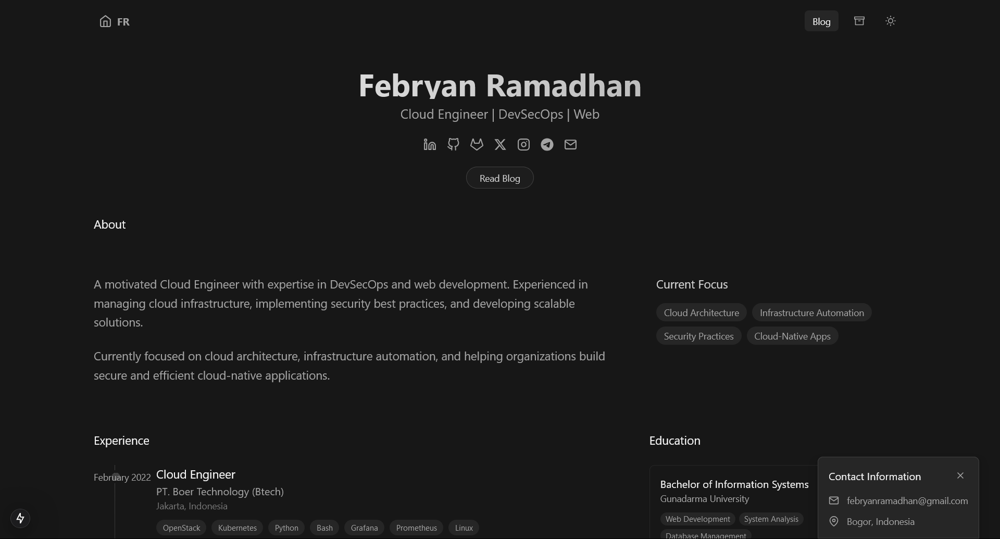

# Personal Portfolio & Blog

A modern, responsive personal portfolio and blog built with Next.js, TailwindCSS, and MDX. Features dark mode, code syntax highlighting, and a fully responsive design.



## ✨ Features

- 🌗 Dark/Light mode support
- 📱 Fully responsive design
- 📝 MDX blog support
- 🎨 Syntax highlighting for code blocks
- 🔍 Blog search functionality
- 🏷️ Tag-based blog filtering
- 📊 Table of contents for blog posts
- 📖 Reading time estimation
- 🔗 Social media integration
- 🚀 Fast page loads with Next.js
- 💅 Styled with TailwindCSS

## 🛠️ Tech Stack

- [Next.js](https://nextjs.org/) - React framework
- [TailwindCSS](https://tailwindcss.com/) - Styling
- [MDX](https://mdxjs.com/) - Markdown/React documentation
- [Framer Motion](https://www.framer.com/motion/) - Animations
- [Rehype Pretty Code](https://rehype-pretty-code.netlify.app/) - Code syntax highlighting
- [React Icons](https://react-icons.github.io/react-icons/) - Icons

## 🚀 Getting Started

### Prerequisites

- Node.js 18+ 
- npm/yarn/pnpm

### Installation

1. Clone the repository:
```bash
git clone https://github.com/yourusername/portfolio.git
cd portfolio
```

2. Install dependencies:
```bash
npm install
# or
yarn install
# or
pnpm install
```

3. Run the development server:
```bash
npm run dev
# or
yarn dev
# or
pnpm dev
```

4. Open [http://localhost:3000](http://localhost:3000) with your browser to see the result.

## 📁 Project Structure

```
portfolio/
├── app/                    # Next.js app directory
│   ├── blog/              # Blog pages
│   ├── components/        # React components
│   ├── config/           # Site configuration
│   └── context/          # React context providers
├── content/              # MDX content
│   └── posts/           # Blog posts
├── public/              # Static assets
└── styles/             # Global styles
```

## 📝 Writing Blog Posts

1. Create a new `.mdx` file in `content/posts/`
2. Add frontmatter:
```markdown
---
title: "Your Post Title"
date: "2024-03-26"
tags: ["tag1", "tag2"]
excerpt: "Brief description of your post"
---

# Your content here
```

3. Write your content using Markdown/MDX

## 🎨 Customization

### Site Configuration
Edit `app/config/components.js` to update:
- Hero section
- Experience
- Education
- Skills
- Contact information
- Social media links

### Styling
- Global styles: `app/globals.css`
- Component styles: Individual component files using TailwindCSS
- Code block themes: `app/styles/mdx.css`

## 📦 Deployment

This project is configured for deployment on GitHub Pages:

1. Update `next.config.mjs`:
```javascript
const nextConfig = {
  output: 'export',
  basePath: '/portfolio',
  // ... other config
};
```

2. Deploy using:
```bash
npm run build
npm run deploy
```

## 🤝 Contributing

Contributions are welcome! Please feel free to submit a Pull Request.

## 📄 License

This project is licensed under the MIT License - see the [LICENSE](LICENSE) file for details.

## 🙏 Acknowledgments

- [Next.js](https://nextjs.org/)
- [TailwindCSS](https://tailwindcss.com/)
- [Vercel](https://vercel.com/)
