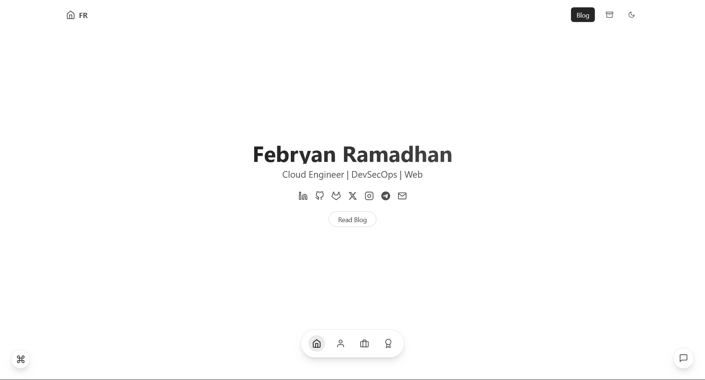

# Personal Portfolio & Blog

A modern, responsive personal portfolio and blog built with Next.js, TailwindCSS, and MDX. Features dark mode, code syntax highlighting, and **optimized SEO with working social media previews**.

🌐 [Live](https://pepryan.github.io/portfolio/)



## ✨ Features

### 🎨 **Design & UX**
- 🌗 Dark/Light mode support
- 📱 Fully responsive design
- 💅 Styled with TailwindCSS
- 🚀 Fast page loads with Next.js
- 📊 Table of contents for blog posts

### 📝 **Blog System**
- 📝 MDX blog support with rich content
- 🎨 Syntax highlighting for code blocks
- 🔍 Advanced blog search functionality
- 🏷️ Tag-based blog filtering with pagination
- 📖 Reading time estimation
- 💬 Giscus comments integration

### 🔍 **SEO & Social Media (FIXED!)**
- ✅ **Social Media Previews**: WhatsApp, Facebook, Twitter, LinkedIn
- ✅ **Meta Tag Optimization**: Proper static HTML rendering
- ✅ **Structured Data**: JSON-LD schema for rich snippets
- ✅ **SEO Validation Tools**: Automated testing
- ✅ **Open Graph & Twitter Cards**: Complete implementation
- 🔗 Social media integration with proper previews

### 📊 **Analytics & Tracking**
- ✅ **Google Analytics 4**: Comprehensive user behavior tracking
- ✅ **Event Tracking**: Blog reads, project views, social clicks
- ✅ **Privacy-Focused**: IP anonymization and GDPR considerations
- ✅ **Real-time Monitoring**: Live user activity and engagement metrics
- ✅ **Performance Insights**: Content optimization and user journey analysis

## 🛠️ Tech Stack

### **Core Technologies**
- [Next.js 15](https://nextjs.org/) - React framework with App Router
- [TailwindCSS](https://tailwindcss.com/) - Utility-first CSS framework
- [MDX](https://mdxjs.com/) - Markdown with React components
- [Framer Motion](https://www.framer.com/motion/) - Animation library

### **Blog & Content**
- [Rehype Pretty Code](https://rehype-pretty-code.netlify.app/) - Code syntax highlighting
- [Gray Matter](https://github.com/jonschlinkert/gray-matter) - Frontmatter parsing
- [Next MDX Remote](https://github.com/hashicorp/next-mdx-remote) - MDX rendering

### **SEO & Analytics**
- **Custom SEO System** - Meta tag injection for static export
- **Structured Data** - JSON-LD schema implementation
- **Social Media Optimization** - Open Graph & Twitter Cards
- **Google Analytics 4** - Comprehensive tracking and insights
- [Next Sitemap](https://github.com/iamvishnusankar/next-sitemap) - Automatic sitemap generation

### **UI & Icons**
- [React Icons](https://react-icons.github.io/react-icons/) - Icon library
- [Giscus](https://giscus.app/) - GitHub-based comments

## 🚀 Getting Started

### Prerequisites

- Node.js 18+ 
- npm/yarn/pnpm

### Installation

1. Clone the repository:
```bash
git clone https://github.com/yourusername/portfolio.git
cd portfolio
```

2. Install dependencies:
```bash
npm install
# or
yarn install
# or
pnpm install
```

3. Run the development server:
```bash
npm run dev
# or
yarn dev
# or
pnpm dev
```

4. Open [http://localhost:3000/portfolio](http://localhost:3000/portfolio) with your browser to see the result.

## 📁 Project Structure

```
portfolio/
├── app/                    # Next.js app directory
│   ├── blog/              # Blog pages & components
│   ├── components/        # Reusable React components
│   ├── config/           # Site configuration
│   ├── context/          # React context providers
│   ├── hooks/            # Custom React hooks
│   └── lib/              # Utility functions
├── content/              # MDX content
│   └── posts/           # Blog posts (.mdx files)
├── docs/                 # Documentation
│   ├── SEO_BEST_PRACTICES.md
│   ├── PERSONAL_DATA_GUIDE.md
│   └── SEO_FIX_DOCUMENTATION.md
├── public/              # Static assets
│   └── images/         # Images & thumbnails
├── scripts/             # Build & utility scripts
│   ├── validate-seo.js
│   ├── test-social-preview.js
│   └── inject-meta-tags.js
└── styles/             # Global styles
```

## 📝 Writing Blog Posts

1. **Create a new `.mdx` file** in `content/posts/`
2. **Use the template** from `content/posts/_template.mdx`
3. **Add complete frontmatter**:
```yaml
---
title: "Your SEO-Optimized Post Title"
date: "2024-03-26"
updated: "2024-03-27" # Optional
tags: ["tag1", "tag2", "tag3"]
summary: "Compelling description 120-160 characters for meta description"
thumbnail: "/portfolio/images/your-image.png" # 1200x630px
author: "Febryan Ramadhan"
category: "Tutorial"
difficulty: "Beginner"
keywords: ["seo", "nextjs", "tutorial"]
draft: false
---

# Your content here
```

4. **Write your content** using Markdown/MDX
5. **Validate before publishing**:
```bash
npm run build          # Build with SEO optimization
npm run validate-seo    # Check SEO compliance
npm run test-social     # Test social media previews
npm run test-analytics  # Test Google Analytics implementation
```

## 🔍 SEO System Overview

### **How It Works**
This portfolio uses a **hybrid SEO approach** that combines Next.js 15's Metadata API with a custom post-build meta tag injection system to ensure perfect social media previews.

### **The Problem We Solved**
Next.js 15 with static export (`output: 'export'`) doesn't properly render meta tags as static HTML. Social media crawlers can't read JavaScript-embedded meta tags, causing blank previews.

### **Our Solution**
1. **Next.js Metadata API**: Provides SEO structure and defaults
2. **Custom Meta Tag Injection**: Post-build script that injects proper HTML meta tags
3. **Automated Validation**: Tools to ensure everything works correctly

### **Technical Implementation**
```bash
# Build process automatically:
next build                    # 1. Generate static files
→ inject-meta-tags.js        # 2. Inject HTML meta tags
→ next-sitemap               # 3. Generate sitemap
```

### **Result**
✅ **Perfect social media previews** on all platforms
✅ **Static HTML meta tags** that crawlers can read
✅ **Automated SEO validation** tools
✅ **Zero manual maintenance** required

## 🎨 Customization

### Site Configuration
Edit `app/config/components.js` to update:
- Hero section
- Experience
- Education
- Skills
- Contact information
- Social media links

### Styling
- Global styles: `app/globals.css`
- Component styles: Individual component files using TailwindCSS
- Code block themes: `app/styles/mdx.css`

## 📦 Deployment

This project is configured for deployment on GitHub Pages with **optimized SEO**:

### **Build Process**
```bash
npm run build    # Includes automatic meta tag injection
npm run deploy   # Deploy to GitHub Pages
```

### **What Happens During Build:**
1. **Next.js Build**: Generates static files
2. **Meta Tag Injection**: Adds proper HTML meta tags for social media
3. **Sitemap Generation**: Creates sitemap.xml automatically
4. **SEO Validation**: Optional validation with `npm run validate-seo`

### **Configuration**
The project is pre-configured with:
- **Static Export**: `output: 'export'` in `next.config.mjs`
- **Base Path**: `/portfolio` for GitHub Pages
- **Asset Prefix**: Proper asset handling
- **Meta Tag System**: Custom SEO implementation

### **GitHub Pages Setup**
1. Enable GitHub Pages in repository settings
2. Set source to "GitHub Actions" or "Deploy from branch"
3. Use the provided deploy script or GitHub Actions workflow

## 🔧 Available Scripts

### **Development**
```bash
npm run dev              # Start development server
npm run build           # Build for production (includes SEO optimization)
npm run start           # Start production server
npm run lint            # Run ESLint
```

### **SEO & Validation**
```bash
npm run validate-seo    # Comprehensive SEO validation
npm run test-social     # Test social media previews
npm run test-analytics  # Test Google Analytics implementation
npm run check-seo       # Non-failing SEO check for CI/CD
npm run inject-meta     # Manual meta tag injection
```

### **Deployment**
```bash
npm run deploy          # Deploy to GitHub Pages
npm run build:next      # Next.js build only (without meta injection)
```

## 🎯 SEO Features

### **✅ What's Working**
- **Social Media Previews**: WhatsApp, Facebook, Twitter, LinkedIn
- **Meta Tags**: Properly rendered in static HTML
- **Structured Data**: JSON-LD schema for rich snippets
- **Open Graph**: Complete implementation
- **Twitter Cards**: Full support
- **Validation Tools**: Automated SEO testing

### **📊 SEO Validation Results**
- ✅ **0 SEO Errors** across all pages
- ✅ **Social Media Previews** working on all platforms
- ⚠️ **6 Minor Warnings** (title/description length optimization)

## 🤝 Contributing

Contributions are welcome! Please feel free to submit a Pull Request.

## 📄 License

This project is licensed under the Personal License - see the [LICENSE](LICENSE) file for details.

## 🙏 Acknowledgments

- [Next.js](https://nextjs.org/) - React framework
- [TailwindCSS](https://tailwindcss.com/) - CSS framework
- [Vercel](https://vercel.com/) - Deployment platform
- [GitHub Pages](https://pages.github.com/) - Static hosting

---

## 📚 Documentation

- 📖 [SEO Best Practices](docs/SEO_BEST_PRACTICES.md)
- 👤 [Personal Data Guide](docs/PERSONAL_DATA_GUIDE.md)
- 🔧 [SEO Fix Documentation](docs/SEO_FIX_DOCUMENTATION.md)
- 📊 [Analytics Implementation Guide](docs/ANALYTICS_IMPLEMENTATION_GUIDE.md)

**Status**: ✅ **SEO OPTIMIZED** - Social media previews working perfectly!
